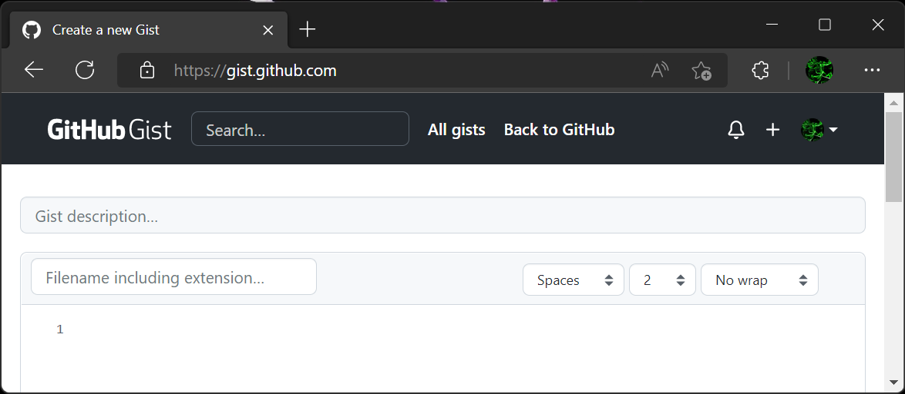
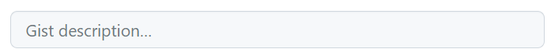
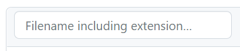
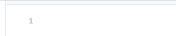
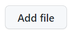
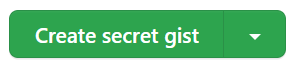
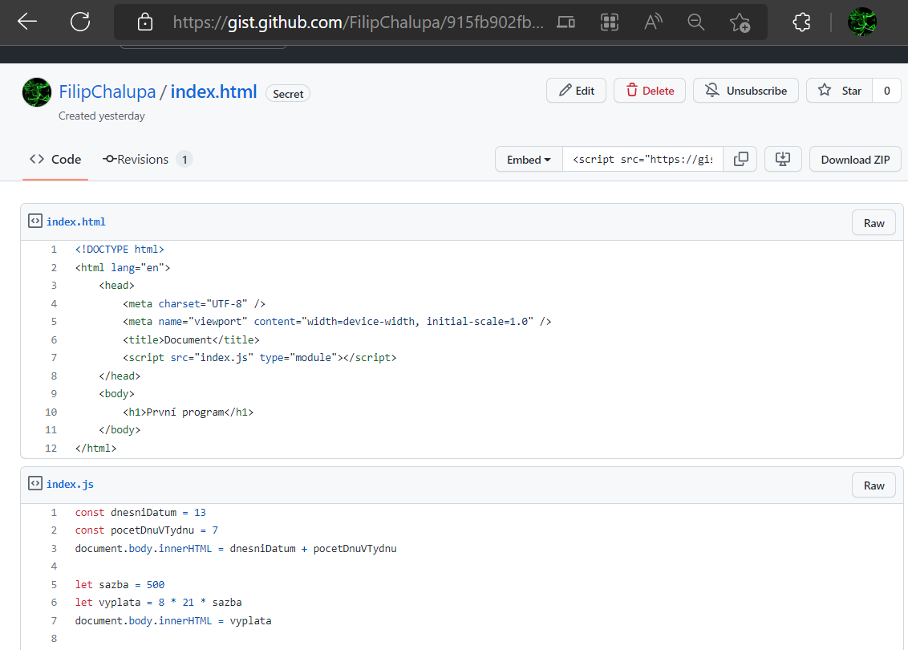
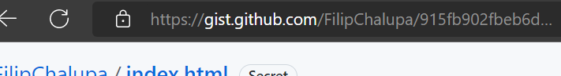
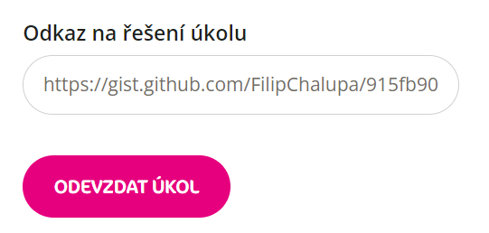

# Jak odevzdat úkol v [Moje Czechitas](https://moje.czechitas.cz/) pomocí [Github Gist](https://gist.github.com/)

1. Najdi si zadání konkrétního úkolu v tvém kurzu na [moje.czechitas.cz](https://moje.czechitas.cz/). `Přihlášky` > _`Kurz`_ > `Domácí úkoly` > _`První úkol`_.

1. Vytvoř si pro úkol složku v tvém počítači.

1. Vypracuj řešení. Všechny soubory patřící k řešení vytvářej ve složce z předchozího kroku.

1. Až budeš mít řešení hotové, přejdi na [gist.github.com](https://gist.github.com/).

   

1. Podle potřeby se v pravém horním rohu přes tlačítko přihlas nebo zaregistruj.
1. Vyplň formulář.

   1. _Gist description_ můžeš nechat prázdné nebo vyplnit poznámkou (např. „Řešení prvního povinného úkolu v kurzu JavaScript 1“).

      

   1. Do _Filename including extension…_ zadej název prvního souboru, který máš v úkolové složce na tvém počítači (např. „index.html“).

      

   1. Do dalšího bloku začínajícího označením prvního řádku překopíruj obsah prvního souboru.

      

   1. Pokud máš souborů více, klikni na tlačítko _Add file_ a opakuj předchozí dva kroky.

      

1. Po překopírování všech souborů klikni vpravo dole na tlačítko _Create secret gist_.

   

1. Výsledek by měl vypadat přibližně takto:

   

1. Formulář tě přesměruje na tajnou unikátní adresu. Komukoliv dáš odkaz na stránku, na které se právě nacházíš, uvidí tvé soubory.

   

1. Tento odkaz vlož u úkolu v Moje Czechitas jako _Odkaz na řešení úkolu_ a klikni na _Odevzdat úkol_.

   
